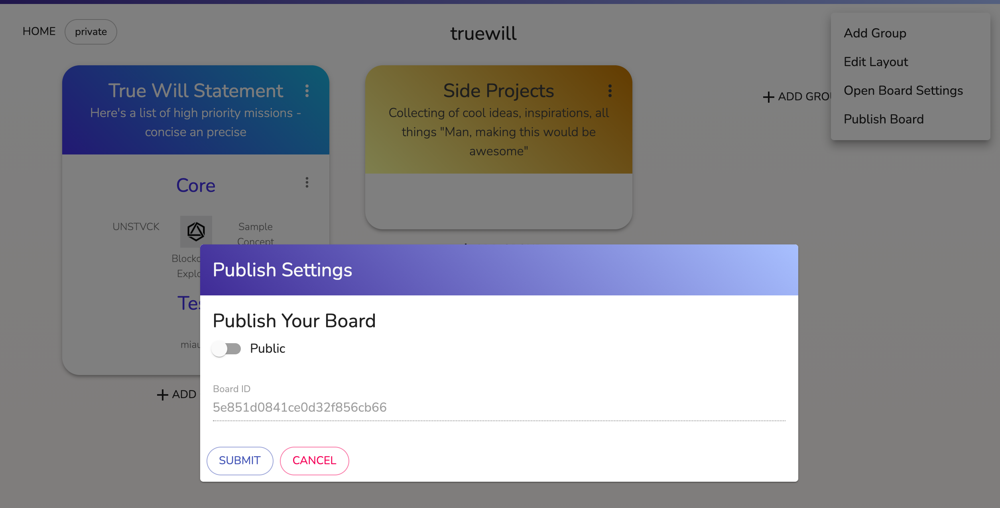

# Portfolio Explorer - Interactive Ecosystem Explorer & Platform

Document, organize, and share ideas in a way that goes beyond lists and bulletpoints.

Portfolio Explorer is an interactive 2D tool to visually represent a company, ecosystem, or a project, allowing public and private metadata sharing across many different domains.

!()[https://thumbs.gfycat.com/DizzyUnawareEnglishpointer-mobile.mp4]

[Demo on Heroku here!](https://blockchain--ecosystem-explorer.herokuapp.com/)

## Why this project?

On the internet we're often presented with a set of icons or images representing the clients that we've worked for, or the products we're experts in.
These images are usually still images, where one needs to click away from the page to read more details, making the user lose context.
On other occasions, the image representing an ecosystem of companies or products, is followed by a boring blogpost, where the details are not clearly linked to the presented 2d-view of an ecosystem.

The need for an interactive 2D-masonry for logos and images, behind which more information gets revealed after I click them, started during my blockchain architecture period, where an overview of the "blockchain ecosystem" was required, but all I could find were still images, and not-so helpful blogposts.

I needed the following:
- A way to organize complex information in a simple 2D-visualization, without refraining to photoshop or powerpoint sofware.
- A way to show detailed information without leaving the context.
- A platform to share gathered information and research in a structured and presentable way.

This is how `Portfolio Explorer` was born (previously called "Project Blockchain Explorer").

## Features

+ Create ecosystem views, enriched with markdown-capable content editing
+ Make use of standard blocks, including pros-cons, mindmaps, and verified url-links
+ Create private ecosystem views before publishing them for public sharing and consumption

## Usage Guide

### Viewing

Portfolio explorer allows you to simply explore an ecosystem. Simply click on the icons to learn more about the underlying tile.

### Board Creation

After logging in, set your `username`, and click on `ADD GROUP` to create a new group. Pick a name, and group color, perhaps add a description for completeness.

### Add Cards

Once a group has been created, navigate to your group, and add subgroups, which hold 'cards' or 'tiles. Simply add a title, a description, and use a simplified markdown-syntax to create a description.

The markdown-syntax, which honestly needs some tweaking, supports **square tags** to enhance the displayed data:

```
# Title

## Substitle

[Here you can add a simple link](URL)

## Add this square tags --> [mindmap]

- ETH
-- EVM
--- Turing Complete Computer
--- Solididty
-- Mining
-- Consensus
-- Transactions
--- speed: 10/s
--- blocksize: < 1mb

## To create a two-column pro con's comparison, use --> [pro-cons]
+ pros have a plus
+ pros are cool
- cons have a minus
- cons are less cool

## You can create a cool list with links using the following tag [Links]

[Homepage](https://ethereum.org/)
[Source](https://github.com/ethereum)

```

### Move `groups`, `subgroups`, and `cards` around.

The implementation features a drag-and-drop feature for customizable layouts. Check out the video below to learn more.


### Publish Board

Once your board is ready, you can publish it for public sharing. You do so easily by going to the settings of a board, clicking 'publish board' and toggling the public switch in the revealed dialog.



## Architecture

### Application Architecture


### Data Architecture


### Permission Model


## Deployment

This version of the application requires a MongoDB host. You can run your own MongoDB Atlas cluster and connect the app.

Ensure to create a `.env` file, with the following lines:

```
DB_HOST=***.mongodb.net
DB_USER=***user***
DB_PASS=***pwd***
```

Ensure to set the `collection` variable in `index.js` to connect to the correct database in MongoDB.

### Deployment on heroku

This application is suitable for deployment in Heroku. Simple run the following command if heroku-cli is installed on your computer:

~~~
git push heroku master
~~~

## Repository contents


## Future Work


